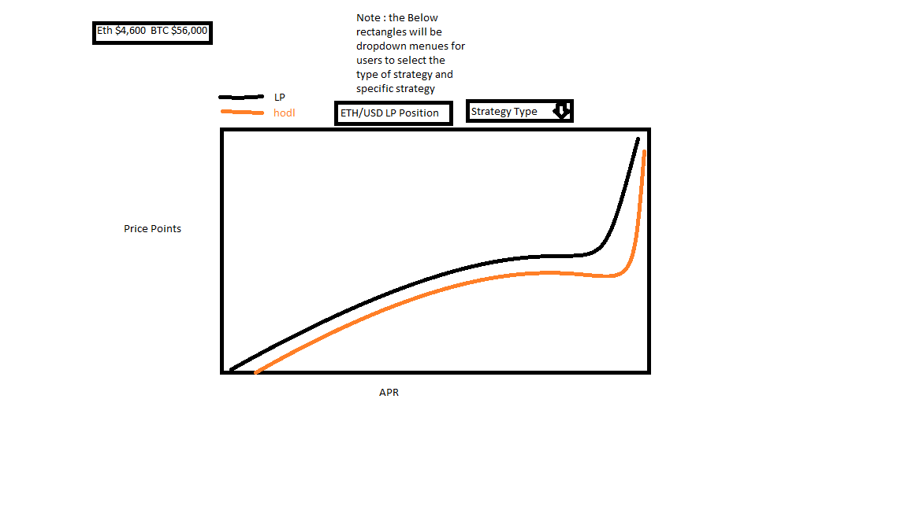

# Strategy Tracker

## Background

The average return from investing in the S&P 500 is around 10% annually. Beating the market in the 
equity markets is notoriously hard - some would say impossible. Interestingly, in the crypto markets 
there exists a lot of opportunity to earn yield that beats the S&P while hedging against the downside. 
This project will allow users to view the current and historical yields for some of these strategies. 

## Functionality & MVPs

In Crypto Strategies Tracker, users will be able to:

1) Browse featured multi-part strategies

2) Select a specific strategy and view the description of the selected strategy along with links to the relevant exchanges

3) The User can select different price points and APRs for the assets involved and see how 
arbitrary price movements would effect value of the position. For example the user can see what the value of his position 
would be if he enters a hedged liquidity provision position for an eth/matic pair at the current prices and ether falls 25%.

4) The user can view historical performence of the strategy on a graph. 

## Libraries and APIs

1) Webpack to bundle the code

2) npm to manage dependencies.

3) D3 library to create graphs showing the performence of a strategy over time.

4) D3 to create graphs showing the value of a position based on selected future price points.

## Implementation Timeline

##### Friday:

Set up the skeleton and get webpack working. Create the strategy class. Get comfortble rendering graphs using D3.

##### Weekend: 

Get comfortable making get requests from the coingecko API and one exchange API. Figure out the layout and structure of the website.

##### Monday

Write the functions and logic to calculate impermanent loss and the Terra delta nuetral strategies. Render the strategies on the screen.

##### Tuesday

Write the logic for the cash and carry strategy and render those on screen in some form

##### Wednesday

Polish up the appearance of the strategies so far. Write additional strategies if there is time.

##### Thursday

Rewrite this as a production README. Work on bonus features.

## Bonus Features

The following updates will hopefully be made in the future:

1) A backend can be built out and integrated with metamask to allow users to login.

2) Fucntionality allowing users to save strategies an set alerts when specified criteria are met 
(e.g. APR of a strategy goes under 20%)

